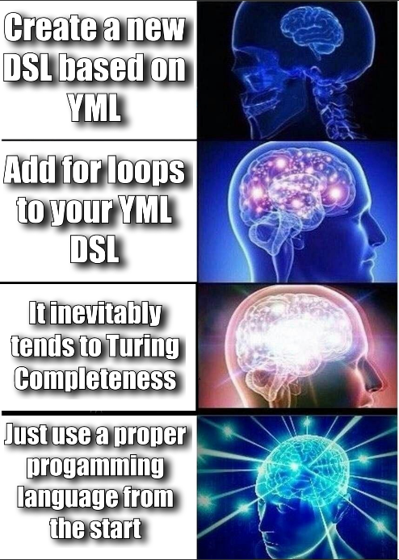
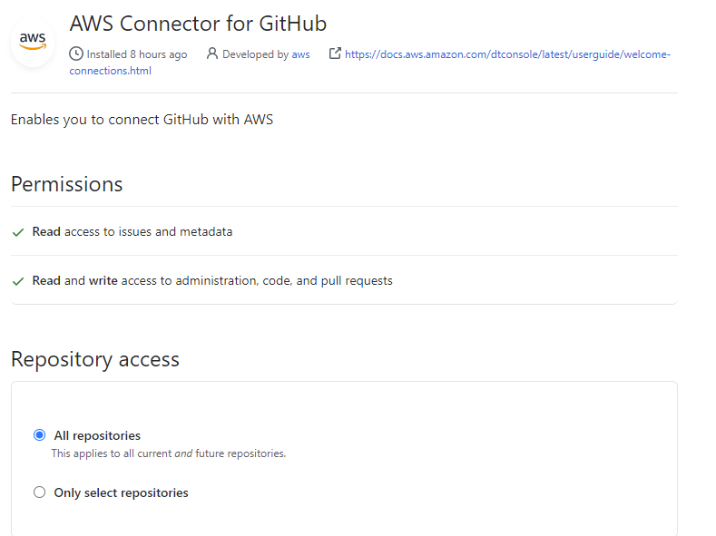
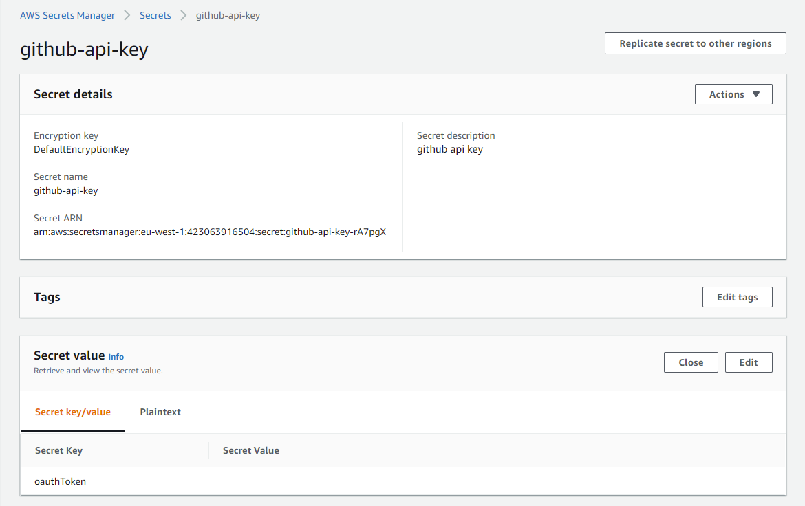
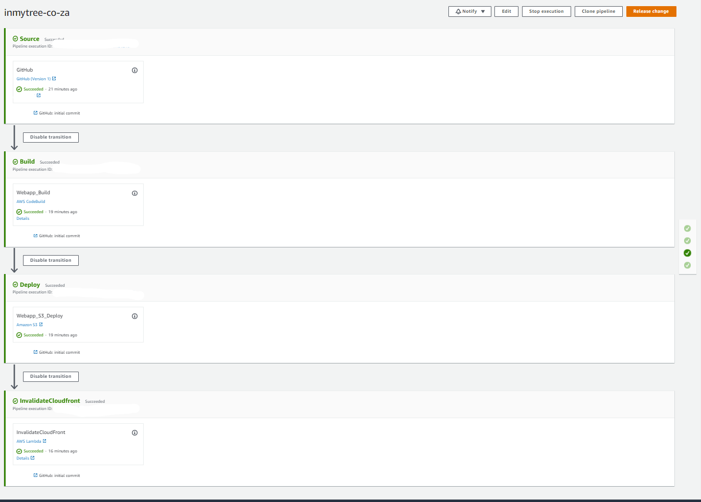

Annoyed with blogging platforms like medium? Yearn for the good old days where we all had to host everything ourselves? If you're a little impractical, old-fashioned, grumpy and nostalgic like me, this article is for you.

I'll show you how to deploy a full static blog using AWS services, without you having to click (much) in the console. We'll be using the following AWS services:

- S3 to store the website
- Cloudfront to serve it
- Route53 to register our domain
- Certificate Manager to create a certificate for https
- Codepipeline to create a pipeline that runs every time we commit

Additionally, we'll be using the [AWS CDK](https://aws.amazon.com/cdk/) to deploy all the services automatically. CDK allows us to define all the infrastructure required using typescript.

The blog itself is written as a [Vue3/Vitepress static site](https://github.com/vuejs/vitepress). You can replace this with any kind of blog you want, such as jekyll,vuepress etc.

## AWS Infrastructure

### Project

The project is laid out as follows:
```shell
cdk/
  bin/
    # the main entrypoint of the CDK stack
    # NB: change the name of your stack here
    cdk.ts
  lib/
    # the definition of what is in the stack is here
    # everything from the S3 Bucket, Cloudfront distribution
    # to the pipeline to deploy the blog
    cdk-stack.ts
app/
   # the files for the vitepress/vue3 blog.
   # running yarn dev in the main directory
   # will start a development server.

```
### Why CDK?

[AWS CDK](https://github.com/vuejs/vitepress) allows you to define cloud infrastructure using your favorite programming language. No more need to learn another custom YAML, or another custom XML/JSON DSL-as-code thing. I just want to write code, in the languages I already know.

<figure>

</figure>


### Setup CDK

To setup the AWS infrastructure, get started by installing and configuring the [AWS CDK](https://github.com/vuejs/vitepress). Make sure that you follow the instructions to get started and can `cdk synth` on a small example project succesfully.

CDK allows us to specify infrastructure, **literally** as code, in my case typescript:

```ts

const websiteBucket = new s3.Bucket(this, 'MyBucket', {
  websiteIndexDocument: 'index.html',
  publicReadAccess: false
});

new s3deploy.BucketDeployment(this, 'DeployWebsite', {
  sources: [s3deploy.Source.asset('../app/.vitepress/dist')],
  destinationBucket: websiteBucket,
});

```

As an example, the above example creates a brand new S3 Bucket, and then copies the data in the specified directory into the bucket.


### Blog infrastructure

Firstly, in the file cdk/bin/cdk.ts, change the name of the stack and the region:

```ts
const app = new cdk.App();
new CdkStack(app, 'mycool-stack')
    {
      env:{
        region: 'my-region'
      }
    }

);
```

In the file cdk/lib/cdk-stack.ts, you can see that we are creating the following:

- An S3 Bucket:

```ts
const websiteBucket = new s3.Bucket(this, 'inmytree-co-za', {
  websiteIndexDocument: 'index.html',
  publicReadAccess: true
});
```

- A cloudfront distribution:

```ts
const cloudfrontDistribution = new cloudfront.Distribution(this, 'inmytree-co-za-distribution', {
  priceClass: cloudfront.PriceClass.PRICE_CLASS_ALL,
  defaultBehavior: {
    origin: new origins.S3Origin(websiteBucket)
  },
  domainNames: [webTarget],
  certificate
});
```

The cloudfront distribution is supplied with a certificate and domain name. In this example, I am using an already created route53 hosted zone and certificate from Certificate Manager - but you can change it to create from scratch as well by the following the CDK documentation.

- Lastly, the pipeline to deploy the blog is created:

```ts
const stages: codepipeline.StageProps[] = [
{
  stageName: 'Source',
  actions: [
    new codepipeline_actions.GitHubSourceAction({
      actionName: 'GitHub',
      owner: 'nicokruger',
      repo: 'inmytree.co.za',
      // this is your API token from GitHub that you need to store
      // as a Secret inside AWS Secrets Manager.
      oauthToken: cdk.SecretValue.secretsManager('github-api-key', { jsonField: 'oauthToken' }),
      output: sourceOutput,
      branch: 'master',
    })
  ],
},
{
  stageName: 'Build',
  actions: [
    new codepipeline_actions.CodeBuildAction({
      actionName: 'Webapp_Build',
      project: webappBuild,
      input: sourceOutput,
      outputs: [webappFilesOutput]
    }),
  ],
},
{
  stageName: 'Deploy',
  actions: [

    new codepipeline_actions.S3DeployAction({
      actionName: 'Webapp_S3_Deploy',
      bucket: websiteBucket,
      input: webappFilesOutput,
    }),
  ],
},
{
  stageName: 'InvalidateCloudfront',
  actions: [
    new codepipeline_actions.LambdaInvokeAction({
      actionName: "InvalidateCloudFront",
      lambda: invalidateCloudfrontLambda,
      userParameters: {
        cloudfrontDistributionId: cloudfrontDistribution.distributionId
      }
    }),
  ]
},
];
```

This pipeline does the following:

- Checks out the code from a GitHub repository.
- Builds the project using yarn.
- Deploys the project to the bucket that is created by the stack.
- Invalidates the Cloudfront distribution so that the new files get returned to users.

### Link GitHub

A step that you will have to do manually, is to create an access token on your GitHub account and store it in AWS inside Secrets Manager. 

First, create a GitHub access token in your GitHub account by going to Settings -> Applications
<figure>

<figcaption>GitHub Access Token Setup</figcaption>
</figure>

After that, create a Secret in AWS Secret Manager, and store it as follows:

<figure>

<figcaption>Adding auth token as a secret</figcaption>
</figure>

You can name the secret whatever you want, just change the typescript accordingly. The "Secret Value" is the API token from your GitHub application configuration.

## Deploying Infrastructure

Now that you have made the required changes and have the CDK setup and running, you can just execute the following:

```bash

> cd cdk
cdk> cdk synth

```

Running this command should produce the CloudFormation template that will be deployed by the CDK. CloudFormation is the best available way to deploy infrastructure into production environments on AWS. I strongly suggest once you get serious with AWS that you get familiar with CloudFormation. Luckily by leveraging the CDK you can get 99% there by just using your favorite programming language!

Once your are happy with your changes, you can deploy the stack as follows:

```bash
> cd cdk
cdk> cdk deploy
inmytree-co-za: deploying...


... takes a while


 ✅  inmytree-co-za (no changes)

Outputs:
stack-name.CloudfrontDomain = xxxxxxxxxx.cloudfront.net

Stack ARN:
arn:aws:cloudformation:eu-west-1:xxxxxxxxxxx:stack/stack-name/a-b-c-d


```

This will go ahead and deploy the CloudFormation stack. It will take a while (especially creating the CloudFront distribution) but after it is completed you should have all the infrastructure needed as well as a pipeline to build the blog itself and deploy it to S3:

<figure>

<figcaption>Deployment Pipeline</figcaption>
</figure>


## Deploying the Blog

Now, finally! Press the "Release Change" button and your blog will build, get deployed to S3 and the CloudFront cache invalidated all through your shiny new pipeline. Once the pipeline is finished, you should see your blog content at the above mentioned CloudfrontDomain - https://xxxxx.cloudfront.net.

Additionally, every time you commit to the master branch the pipeline should run and your changes deployed automatically.

## Finished

That's it! I hope this post can give you an idea on other options to host blogs in modern times, by taking advantage of AWS cloud features. This type of setup will basically fall under the AWS free tier until that runs out. After that, the cost will be less than $1 a month, unless you hit reddit-type traffic :-)


