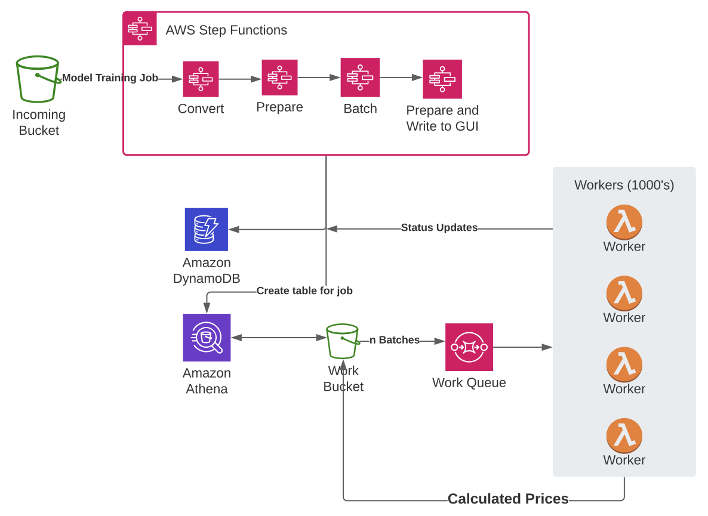

At my employer Digitata, we recently redesigned our pricing algorithm to run AWS native. In this super cool blog post, I'll show you how, but more importantly **why** we are seeing a decrease in training times of up to 100x.

As you may already know, the basic ways of speeding up any kind of algorithm, can be summed up as always <span class="text-xs">(*non exhaustive list*)</span>:

- Use a bigger machine. Not always practical or affordable.
- Run it in parallel.
- Optimise the algorithm. Usually starting with the data preparation.

Traditionally at Digitata, we have preferred the lazy option: #1 - just make the machine bigger! This time, however, we decided to do it _right_.  We decided to run it in parallel. After all, that's what AWS is really good at, right?

## How

By embracing a work queue-based design, and taking advantage of the inherent parallel nature of pricing optimisation calculations, we can achieve a massive speedup in training times by combining Lambda, SQS and Athena:
<figure>

<figcaption>The current design</figcaption>
</figure>

We use Step Functions and DynamoDB to coordinate all the different states of the training pipeline - from data validation, data prep to post-processing the model output so that it is usable by the system.

## Making it parallel

Machine learning algorithms generally involve computationally intensive operations on large data sets. As your data sets starts growing, you will find major benefit by splitting your data set, and thus the work, into independent sets of work for your algorithm. We'll call this, the _unit of work_. First, you have to determine what will be the unit of work for your specific algorithm.

In the case of our model, this was easy. One look into the core of the python code, you find a function such as this:

```python
def calculate_data_price(row):
  dimensions = [row.segment, row.location, row.product]
  # some code here that makes the model do its thing
  # lots of clever work here
  return price

def calculate_voice_price(row):
  dimensions = [row.cell, row.time]
  # some code here that makes the model do its thing
  # lots of clever work here
  return price

```

So our unit of work is the tuple (segment, location, product) in the case of data, and (cell, time) in the case of voice.

### Problems you may have

- Data points that depend on one another - such as forecasting on a time series.


## Rewrite your algorithm to be idempotent and unit-based

Once you know what your unit of work is, refactor your code so that it works on a unit of work. You basically want to end up with something like this:

```python
def do_work(item):
  # in our case, this now checks for a "type of job" - ie. voice or data.
  # so that we have one entry point

  # more ML magic redacted

```

It's also important to ensure that your code is idempotent - there should be no nasty side effects if it executes the same unit of work twice. In our case, it'll just the output the same price twice - wasted CPU cycles but no damage done.


### Step 1. Change your data prep to query units of work.
It's one thing changing your code to work on a unit of work, but you will also need to change your data preparation queries to do the same. Ideally, you'll have all the data required available in a single data source, but this is not always practical. At the end of the day, we want to use leverage Athena with a CTAS (Create Table As) query that leverages Athena's built-in bucketing feature to split the work into batches of units of work - in our case, 1000's of batches.

```sql
# athena query
CREATE TABLE \${$.batchTableName}
WITH (
    format = 'JSON',
    external_location = '${dataProps.dataBucket.s3UrlForObject('processing')}/\${$.jobId}/',
    bucketed_by = ARRAY['jobid'],
    bucket_count = 3000
AS SELECT *
FROM source_data
WHERE "$path" = '\${$.file}'

```

This simple SQL query will execute the select query against your source data, and split it into **bucket_count** batches on the field specified by **bucketed_by** and store each batch in separate files in the S3 path provided by **external_location**. Easy!


### Step 2. Lambda

Next step (after testing of course), is to create a lambda function. Usually this is as simple as wrapping your code in a lambda handler, and using the CDK constructs to create a lambda function: 

```typescript
const workFunction = new PythonFunction(this, 'WorkFunction', {
  entry: '../productgroup_model', // required
  index: 'lambda_main.py', // optional, defaults to 'index.py'
  handler: 'work_handler', // optional, defaults to 'handler',
  memorySize: 2048,
  timeout: cdk.Duration.minutes(5),
  environment: {
    DATA_BUCKET: dataBucket.bucketName,
    JOBS_TABLE: jobsTable.tableName,
  }
});

```

The code for the main lambda handler, reads the incoming batches from SQS and then calls our model training function from our package:
```python
def work_handler(event, context):
    t1 = time.time()

    records = event['Records']
    total_num_jobs = 0

    for record in records:

        body = simplejson.loads(record['body'])

        batches = body['Records']
        batches_count = len(batches)
        for batch in batches:
          process_batch(batch)

          total_num_jobs += 1

    t2 = time.time()

    print("%i batches, %i jobs, time taken: %.2f" % (batches_count, total_num_jobs, t2 - t1))

```

In the next step, we will connect the batch output that gets written onto S3 to SQS, which will then call the *work_handler* passing it each of our batch files in the *Records* array. 

### Problems you may have

- Depending on the external libs your code depends on, you may go over the Lambda limit. Luckily, pandas + numpy by itself **just** seem to fit. If you are hitting the limits, you can look at using a pre-prepared Lambda Layer that may have the dependencies you need.


## SQS 

You may have guessed that the next step would be to create the SQS queue:

```typescript
const workQueue = new sqs.Queue(this, 'WorkQueue2', {
  visibilityTimeout: cdk.Duration.minutes(6),
  receiveMessageWaitTime: cdk.Duration.seconds(19),
  deadLetterQueue: {
    queue: workDeadLetterQueue,
    maxReceiveCount: 1
  }
});
```

The important parameters here are visibilityTimeout and receiveMessageWaitTime. You must ensure that the maximum runtime of your lambda function is less than visibilityTimeout. visibilityTimeout is the amount of time that SQS will consider your message as "not processed yet". If it has been in the queue for longer than that, SQS will consider your message to have timed out, and will re-submit your message.

SQS will continue resubmitting messages on failure on timeouts to your lambda function until it reaches *maxReceiveCount*. Once it reaches maxReceiveCount the message will be sent to the dead letter queue, or discarded if no dead letter queue is configured.

## S3 to SQS

The next step is to populate the SQS queue with the names of the batch files being produced by Athena in order for our Lambda function to process the files. Luckily, using CDK, this is really easy:

```typescript
dataBucket.addEventNotification(
  s3.EventType.OBJECT_CREATED,
  new s3n.SqsDestination(workQueue),
  {
    prefix: 'processing/'
  }

);
```

Any object being written to the processing/ prefix in the bucket, will be populated into the SQS queue automatically by S3 itself.

## SQS to Lambda

Now, we finally get to the last step! The only remaining thing is to have our Lambda function process the messages in the SQS queue. Again, CDK makes this really easy:

```typescript
workFunction.addEventSource(new lambdaevents.SqsEventSource(workQueue, {
  batchSize: 3
}));
```

Lambda will wait for up to 3 messages and then call our Lambda function with the messages from the SQS queue in the 'Records' array in the Lambda payload. This allows us to process the batch objects that were written to S3 one by one and take advantage of massive parallelism!

## So what actually happens?

The culmination of all of this, is that when the bucketing Athena query is run, the following happens:

- Up to 3000 separate objects, each containing independent units of work is created in S3, under the processing/ prefix.
- As these objects are created, S3 will automatically add the details of each object to SQS.
- Lambda processes these messages off of SQS in batch sizes that we can specify, allowing us massive parallelism at very low cost.

## Why its good for us

We are seeing improvements in training times of up to 100x. Jobs that used to take 40 minutes are taking 1 minute or less, using a batch size of around 3,000.

Future improvements:
- With a batch size of 3,000, it seems as if Lambda is utilising around 300 concurrent lambda invocations. Perhaps we can up this number somehow, by tuning Lambda itself or reaching out to AWS support or SA?
- Initial tests leveraging ECS and Batch from SQS instead of Lambda had massive potential in terms of speed improvements for larger jobs - but this has a cost implication. It is however worth investigating further what can be done to lower the cost of this solution.
