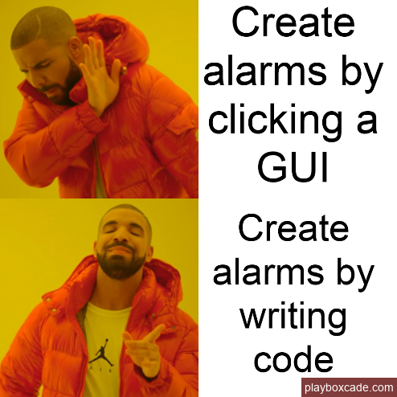
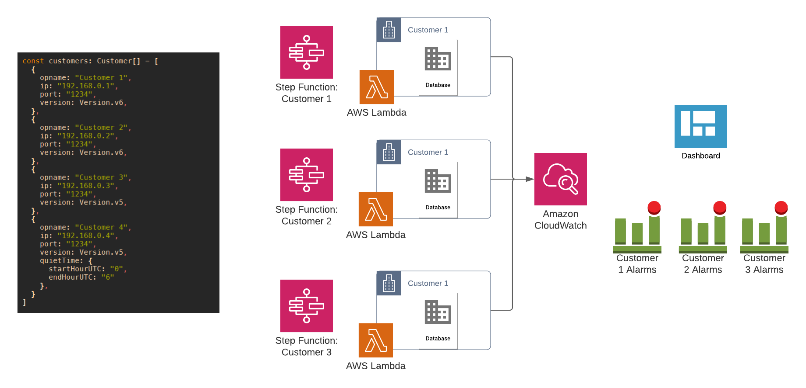
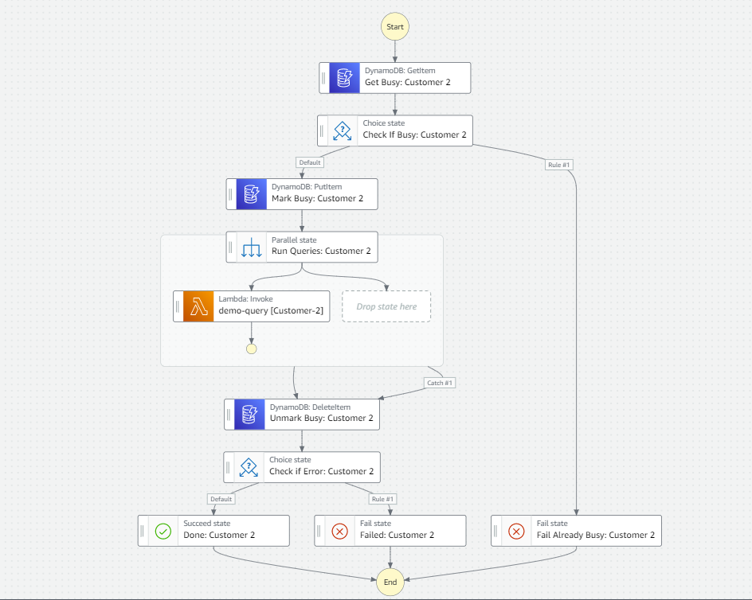
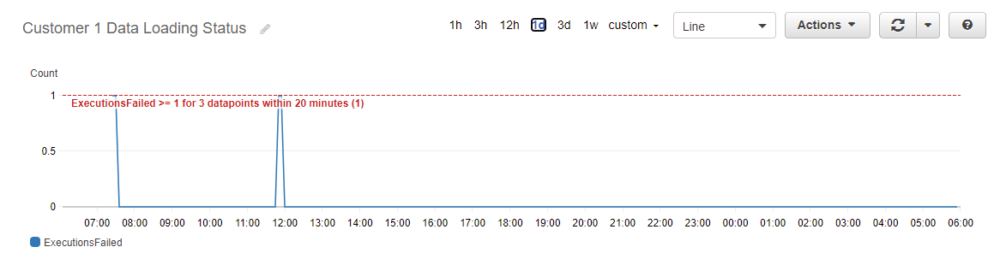
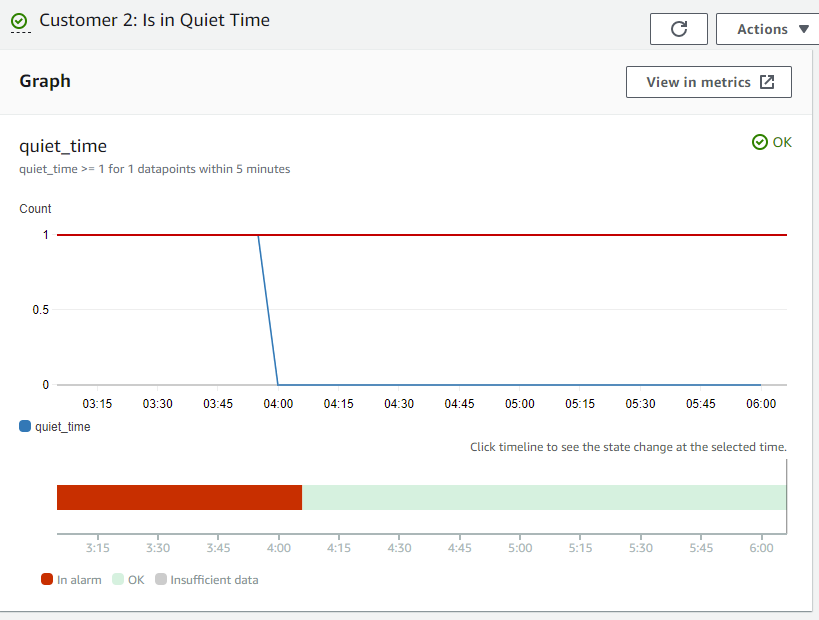
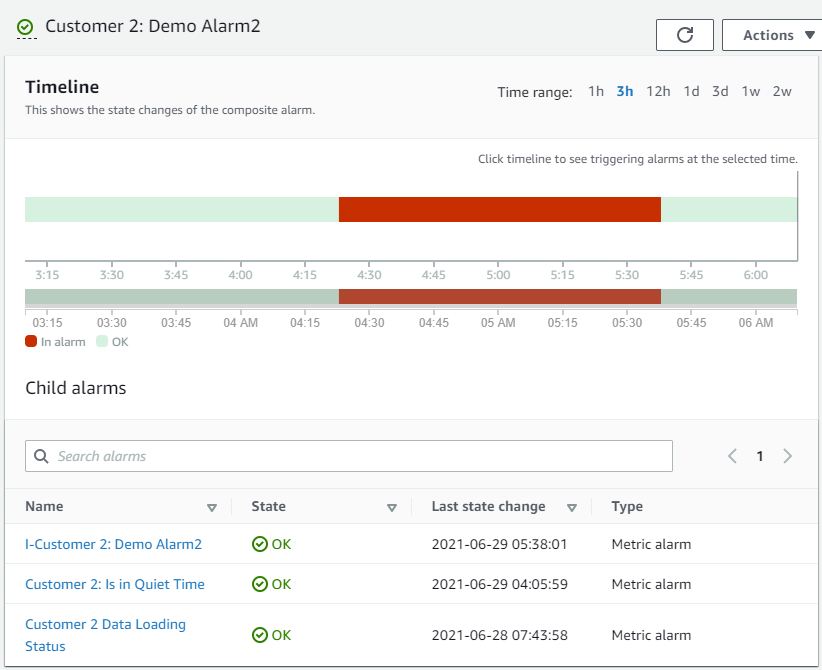

<figure>

</figure>


So, you have some existing customers. They run on-premise. Either your premises, or in the case of the telecoms industry, on your customers' premises.

Maybe you have a centralised monitoring system already, maybe you're monitoring from each deployment seperately, using something like Zabbix, nagios or such.

You dream of a day where all your deployments run in AWS. Wouldn't that be nice? Then I could just use CloudWatch right?

I'll show you how at [Digitata](https://vaitom.digitata.com), we are pulling all our important on-premise metrics/KPI's into CloudWatch using a robust, serverless and low-cost approach by leveraging Step Functions, CDK, your VPC and Lambda.

[Click here for a complete sample project](https://github.com/nicokruger/cdk-cloudwatch-monitoring) - the example project will get you up and running in no time. Read through the description of what we did and why we did it on the blog here.


## What we built

<figure>

</figure>

A fully infrastructure-as-code operational monitoring stack that uses AWS Step Functions and your
VPC to run lambda functions that connect to your on-premise databases, runs queries and
stores them as CloudWatch metrics on any time interval you want.

## How did we build it

By combining the following building blocks:
- [Step Functions](https://aws.amazon.com/step-functions/?step-functions.sort-by=item.additionalFields.postDateTime&step-functions.sort-order=desc) is a serverless state machine that allows you to create workflows. These workflows can be triggered manually or automatically - in our case, on a schedule through [Amazon EventBridge](https://aws.amazon.com/eventbridge/)
- [Lambda](https://aws.amazon.com/lambda/) is used to run the queries against the on-prem database (using python in our case.)
- [CloudWatch](https://aws.amazon.com/cloudwatch/) as the monitoring service that stores the metrics received from the on-prem databases, manages the alarms and provides a dashboard.
- [CDK](https://aws.amazon.com/cdk/) allows you to define your infrastrcture as code in your preferred progmming language.

The flow is as follows:
 - Every 5 minutes, a step function state machine is started for each customer.
 - The Step Function state machines check if it is already running. If it is already running, it fails immediately.
 - Otherwise, the Step Function executes all queries for the specific customer in parallel.
 - After each query is completed, the resulting metric is stored in CloudWatch as a metric.
 - Additionally, the execution state of the State Machine itself is available as CloudWatch as a metric.

That covers the main flow. From the stack, you also get the following:

 - A number of alarms on your metrics.
 - An overview Dashboard showing all customers, alarms and metrics.
 - Data Loading alarms - if a customer DB is down for example, you get one alarm instead of all alarms firing at the same time.
   More about this later.
 - The ability to configure *quiet times* - during which an alarm will be disabled.
   More about this later.

## Advantages of this approach

- Take advantage of normal CI/CD practices, to also *manage your operational alarms and
  metrics*. This means you use IaC to describe your *entire alarming stack*.
- Serverless - there is no infrastrcture for you to manage.
- Leverages CloudWatch. If you are using AWS chances are good you are familiar with CloudWatch already.
- Easy to add/modify alarms to all of your customers at once. Because it is leveraging IaC, this makes it easy to add/modify alarms to all of your customers at once.

To add a new alarm, you change the CDK stack and commit. A pipeline then runs and updates
the CloudFormation Stack. To change the threshold of an alarm, you follow the same
process. You do *not* change anything on the AWS console. No alarms are added or modified
there.

## Why Step Functions?

The two main reasons we settled on using Step Functions are:

  - For observability purposes. If there is a problem during data fetching, it is possible to alarm on this failure as well. Additionally, you can go back end review past executions to why they failed.
  - To block concurrent executions to the same customer. If for whatever reason, the database is taking a long time to execute any of your queries, we immediately fail the following execution so as to not start any more queries.

<figure>

</figure>

The combination of these two reasons have proven to be invaluable in terms of false positives and trust in the alarms. When a state machine fails, that also produces a CloudWatch metric which you can alarm on. We then use Composite Alarms to only fire actual alarms when the Data Loading alarm is not active.

This allows us to get one alarm if there are any database / VPN issues, instead of 10's of alarms all firing at the same time.

## Data Loading Alarms

To create data loading alarms for each customer, we simply create an alarm that monitors the amount of step function state machine failures for that customer. Such as:

<figure>

</figure>

## Quiet Time Alarms

To simulate quiet times (a time period during which an alarm should be silenced), we have a lambda that runs on a schedule, and sets a CloudWatch metric to 0 if the customer is not in quiet time, or 1 if the customer is in quiet time. We then create an alarm that fires when that value is 1, ie. when the customer is in quiet time. It looks like this:
<figure>

</figure>

## Composite Alarms

A big part of reducing the number of alarms, say in case there is a connectivity problem to one of the databases is to leverage [CloudWatch Composite Alarms](https://docs.aws.amazon.com/AmazonCloudWatch/latest/monitoring/Create_Composite_Alarm.html). We use Composite Alarms to reduce alarm noise in the following ways:
 - Raise fewer alarms when there are connectivity / database issues.
 - Setup quiet times during which period certain alarms for a customer will not fire. A quiet time period is simply configured by a start and end hour.

Each KPI alarm is actually a combination of other alarms. It looks like this:

```
kpi_alarm = NOT(data_loading) and NOT(quiet_time) and inner_kpi_alarm
```

So for each KPI, we setup two alarms. One, called the "inner" alarm is the actual alarm that watches the metric. We do not configure any notifications in CloudWatch from the inner alarm. We then configure notifications only on "kpi_alarm" in the above case. This means that we only get notifications for alarms on the above kpi when the following conditions are met:

 - There is no data_loading alarm on the customer.
 - The customer is not in quiet time.
 - The actual kpi alarm is firing.

An example of an alarm:
<figure>

</figure>

So the alarm "Customer 2: Demo Alarm2" will only fire when there are no data loading issues and the customer is not in quiet time. Perfect to reduce noise! You can easily setup CloudWatch notifications (also through CDK) on this alarm and know that you will be only be alerted when your attention is required.


## Prerequisities

- VPC setup in your AWS account(s) that can connect to your on-premise databases.
- A set of queries that pulls your important metrics. These queries will be run
  in parallel on a schedule through Step Functions.
- (optional, but recommended) a seperate AWS account to house your monitoring
  infrastructure if you are using Organizations.

## CDK

The following CDK modules are utilised to create the stack:

- [aws-cloudwatch](https://docs.aws.amazon.com/cdk/api/latest/docs/aws-cloudwatch-readme.html)
- [aws-cloudwatch-actions](https://docs.aws.amazon.com/cdk/api/latest/docs/aws-cloudwatch-actions-readme.html)
- [aws-stepfunctions](https://docs.aws.amazon.com/cdk/api/latest/docs/aws-stepfunctions-readme.html)
- [aws-stepfunctions-tasks](https://docs.aws.amazon.com/cdk/api/latest/docs/aws-stepfunctions-tasks-readme.html)
- [aws-dynamodb](https://docs.aws.amazon.com/cdk/api/latest/docs/aws-dynamodb-readme.html)
- [aws-events](https://docs.aws.amazon.com/cdk/api/latest/docs/aws-events-readme.html)
- [aws-events-targets](https://docs.aws.amazon.com/cdk/api/latest/docs/aws-events-targets-readme.html)

## Example Stack

You can check out an example stack on [my github](https://github.com/nicokruger/cdk-cloudwatch-monitoring). The example stack requires a single dev RDS to be deployed to an account. From there, you can follow the steps in the repo to deploy a starter stack to get started with this approach.

You will get a stack that consists of:

 - Two "customers" - pulling sample data from your RDS.
 - Two metrics - one per customer
 - Two alarms - one per metric
 - 3 Dashboards: Overview + one for each customer

## Additional Functionality

Some of the added functionality that we have added to the stack:

 - Alarming to OpsGenie by using SNS topics that integrations with OpsGenie.
 - Different levels of alarms
 - CloudWatch Anomaly Detection

## Future

 - Lookout for Metrics
 - Connect to more types of databases
 - Real time data from Kafka
 - Can this replace our quiet time feature? [CloudWatch Adds New Metric Math Functions](https://aws.amazon.com/about-aws/whats-new/2021/06/cloudwatch-adds-new-metric-math-functions/)
