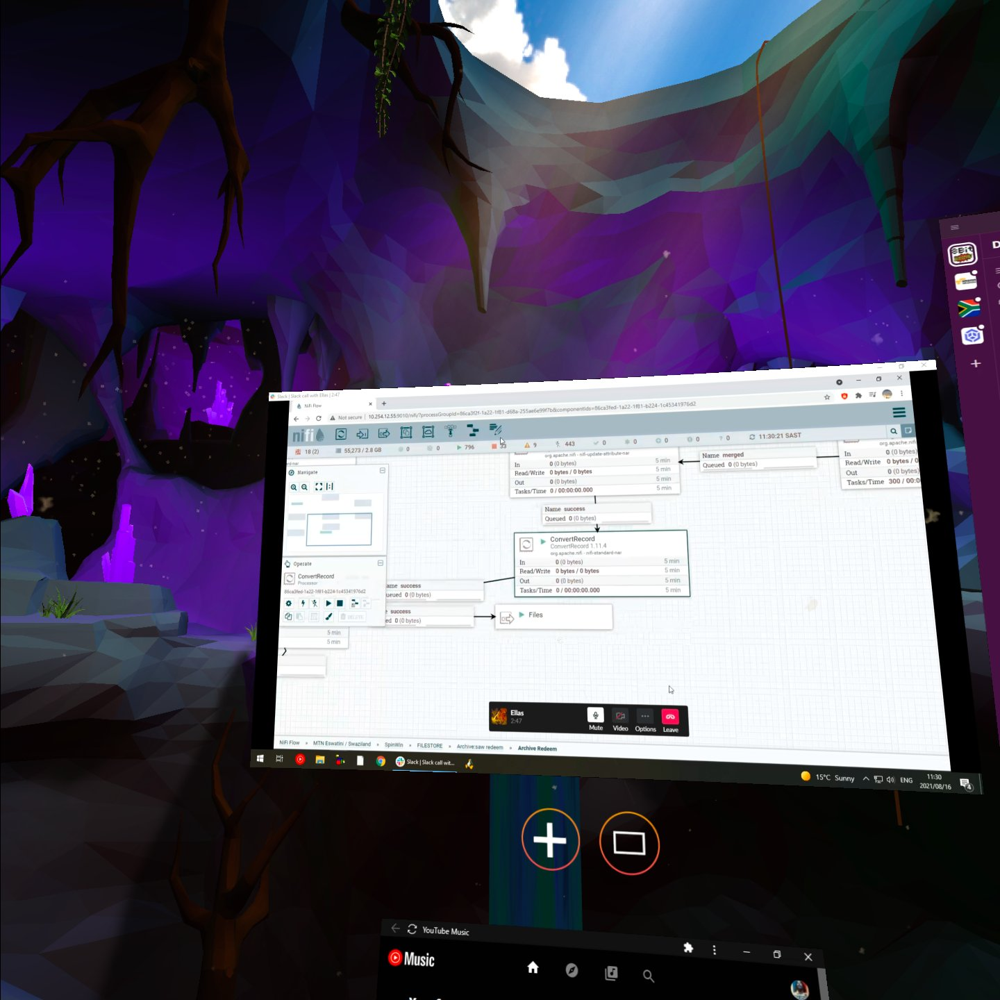
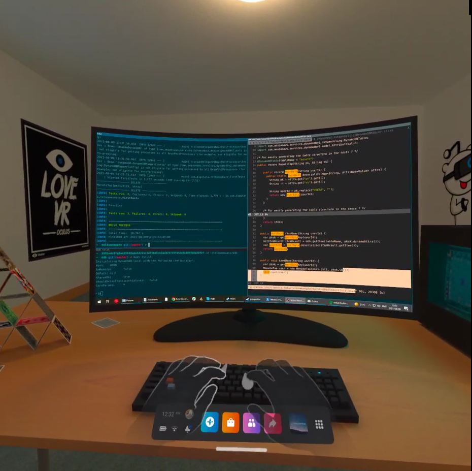
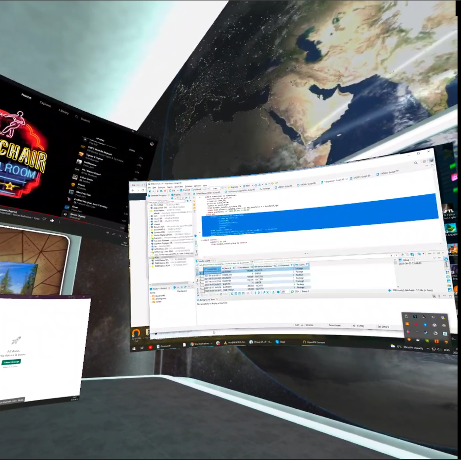
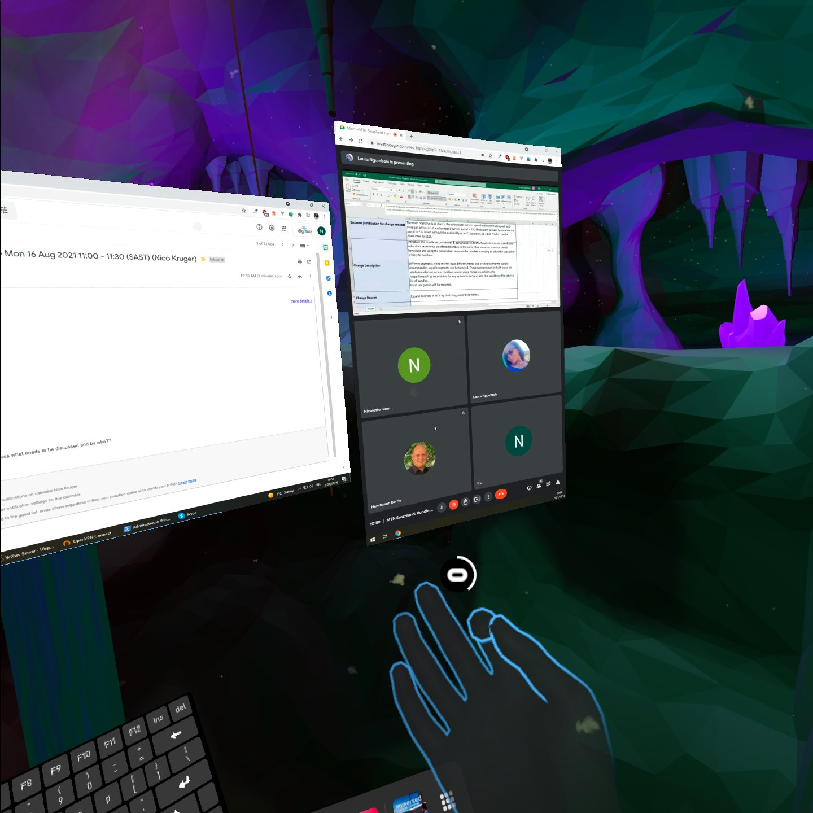
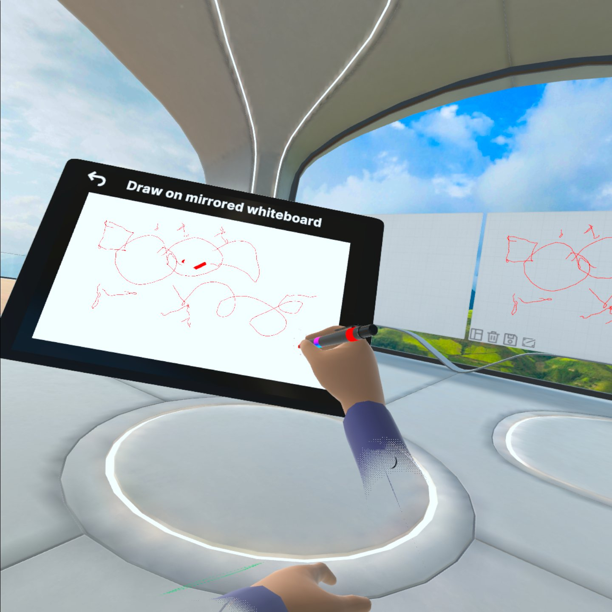

Like many of you, my morning starts with coffee, catching up on news and then getting into work: Reading/replying to emails, looking at my calendar, planning my day and then moving on to work tasks. Pretty normal morning routine, right?

Except that for the last week, I've been doing the above in a magical cave, a log cabin overlooking a mountain, a space station orbiting the Earth, and many more exotic locations.

I've been working in **[Virtual Reality](https://en.wikipedia.org/wiki/Virtual_reality)** for the last week.

<figure>

</figure>

# Working in Virtual Reality

One of the benefits of my job is I have an excuse to try new things. So a week or so ago [Digitata](https://www.digitata.com) bought an [Oculus Quest 2](https://www.oculus.com/quest-2/) so that I can evaluate the relevance of Virtual Reality for Digitata's remote work future.

The goals of this experiment for the following month or so is as follows:

  1. Actually work in VR for a couple of hours every day.
  2. Be at least as productive as I would have been previously. Ideally, I would be more productive.
  3. I need to be able to complete at least the following tasks in VR:
      - Write code
      - Read and reply to emails
      - Attend meetings with coworkers
      - Use things like Slack, the AWS console etc. without any issues.

  4. Experience and test collaboration inside VR.
  5. Host a meeting/presentation of some sort in VR.

This first part is about #1, #2 and #3.

## Why work in Virtual Reality?
The benefits of Virtual Reality for work/productivity applications can be summarised as follows:

  - Virtual Screens.
  - Isolation.
  - Presence.
  - Collaboration.

## How does VR solve these things?

### Virtual Screens
You can have as many screens as you want. Imagine an IMAX sized screen with your code on it. Or a physically impossible curved and portrait screen floating in the air, or even below you. You are not bound by the laws of physics in Virtual Reality.

### Isolation
You can completely remove yourself from your physical surroundings and focus. The environment is completely customisable and free from distractions (unless you allow them...).

### Presence
One of the things we all miss from the days of going to office is being present with other people. VR goes some way to alleviate this. You can share a workspace with others and experience proximity and presence again, even when working from home.

### Collaboration
This is the thing I miss the most. Working together in small groups hunched over a computer solving a problem. Virtual Reality allows us to share our fanciful impossible screens so that others can view them as well. Shared whiteboards allow us to plan and draw together, all with your hands and without requiring any special equipment like tablets.

## Progress so far

### Videos

  <figure class="contain">
    <iframe class="block mx-auto" src="https://www.youtube.com/embed/mWYdQuVMBa0" frameborder="0" allowfullscreen></iframe>
  </figure>

  <figure class="contain">
    <iframe class="block mx-auto" src="https://www.youtube.com/embed/W4reI1N76X4" frameborder="0" allowfullscreen></iframe>
  </figure>

### Screenshots

  <figure class="contain">
    
  </figure>

  <figure class="contain">
    
  </figure>

  <figure class="contain">
    
  </figure>

  <figure class="contain">
    
  </figure>

## My setup

I use [Windows Subsystem for Linux (WSL)](https://docs.microsoft.com/en-us/windows/wsl/install-win10) on Windows 10. In WSL I use a combination of [i3wm](https://i3wm.org/), [Vcxsrv](https://sourceforge.net/projects/vcxsrv/), [vim](https://www.vim.org/) and [tmux](https://github.com/tmux/tmux/wiki) to get a keyboard based tiling window based setup. I also use the [Vimium](https://chrome.google.com/webstore/detail/vimium/dbepggeogbaibhgnhhndojpepiihcmeb?hl=en) extension for Chrome which allows me to drive the browser through the keyboard.

The above setup lends itself well to the current state of working in VR - the absence of VR keyboards or physical keyboards that have a presence in VR makes it so that you have to touch type. You need to try and reduce the amount of mouse work required as much as possible. It is still more than possible to use the mouse in VR (in fact I tested a mouse heavy work load as well and it worked well) however it does get slightly infuriating when reaching blindly for the mouse while looking at your VR environment.

All of this will become better over time as more peripherals are brought into VR, such as the [Logitech K830 Keyboard](https://www.takealot.com/logitech-k830-illuminated-living-room-keyboard/PLID33052364).

## Experience

My experience has been consistently amazing. I find myself spending more and more time in VR sessions every day. Text is more than readable (although if you look closely it does shimmer a bit), especially in the center of your view. At the sides text can be blurry at times, however. Getting the headset to fit correctly is of paramount importance.

Battery life is good enough, but could be better. My battery tends to last between 3 and 4 hours. Luckily, you can keep the headset plugged into your computer while working since you will probably be sitting in a stationary position anyway.

Performance is excellent. The headset itself is more than powerful enough to display the relevant virtual screens and the head tracking is so good that you forget that you have a headset on. The hand tracking is better than I expected and is only destined to get better - even though it is still considered an experimental feature, I very rarely had any issues with the hand tracking. I am certain that the next generation will have perfected this and possess increased horsepower so we can have even better, more elaborate environments to work in. The future is incredibly bright!

You can find more details on my day to day experience and thoughts in the diary at the end of the article.

## Benefits

Some cool benefits I found:
  - I need less space on my desk because I don't need physical screens anymore.
  - I can actually read the text in VR without my glasses. I still get fatigue without them but at least I can read the text without glasses!
  - In the mornings I get glare in my home office from the morning sun. When I am in VR of course this is not an issue - but it is quite striking when I take the headset off and have to deal with the glare on my main monitor afterwards!
  - I completely and utterly lose track of time. It really does help me to focus.

## Next Steps

- For the next couple of weeks I am going to focus on meetings and presentations in VR with my coworkers. Apps like [MeetinVR](https://www.meetinvr.com/), [Spatial](https://spatial.io/) show massive potential in this space.

- Continuously try to improve my work setup. The obvious next step is to wire CAT-6 to my desktop and get rid of Ethernet over Power (more on that in diary below)

## Conclusion

I believe that working in VR by yourself is already _at least as productive_ as working normally, with an inclination to actually _make you more productive_ under the following circumstances:
---

 - You can touch type to a reasonable extent.
 - You only have one or two screens on your work desk at the moment.
 - You have strong Wifi on your LAN (5ghz Wifi at least).
 - You have a strong PC/Laptop connected over ethernet to your LAN (preferably 1gbps LAN connection, but I have gotten away so far with less with some slow down when sharing larger screens).
 - Your day to day work doesn't require you to interact with your phone much. There are ways to get your phone into VR, but I haven't gotten any of them to work thus far (I also didn't try that hard, as my day-to-day does not require me to take customer calls etc.)
 - You need to minimise the amount of times that you have to take the headset off as well as the amount of time you spend fumbling around trying to find the keys on the keyboard or reaching for the mouse.

The potential here is amazing and I am convinced that this is something I will do on a regular basis going forward.

## My rough Diary

Below my diary with notes I took as I was going through the experience. Much more detailed information provided here for anyone interested in trying this for themselves and reading through my ramblings...

### Day 1

Got the quest. Installed and set everything up. The initial on-boarding experience from the tutorials is absolutely amazing. The visual quality of the Quest 2 is far beyond anything I've experienced in VR so far - specifically compared to the earlier models like the Rift DK2 that I played with.

The advantage of the headset being wireless is immediately apparent. Walking around in VR is an experience that is completely overwhelming and amazing. Being able to move around and change your "play area" is incredibly useful and convenient.

You can stream the headset to Chromecast if you have one.

I quickly tried out the following apps on the first day:

  - Bigscreen Beta - very polished shared watching experience. You can watch content in shared rooms with other users and the tutorial is amazing! However, I cannot register because of a server error from Bigscreen side so I couldn't test the screen streaming functions.
  - Echo VR - the most amazing VR experience. Definitely check this out if you get a VR headset!
  - [Virtual Desktop](https://www.vrdesktop.net/)/[Immersed VR](https://immersed.com/) - Immersed is very solid and extremely fast desktop streaming app with a focus on productivity and work, in contrast to Virtual Desktop which is mainly focused on gaming. Virtual Desktop has got amazing streaming technology so would definitely recommend as a way to play your PC/PCVR games in VR!
  - Netflix - very basic but solid way to watch Netflix on IMAX/Cinema screens in VR!

### Day 2

Really focused on getting streaming working well from my Desktop PC to the Quest. It becomes immediately apparent that my LAN Wifi is becoming a bottleneck - this will be a common theme in the next couple of days as VR seems to be really good at highlighting bottlenecks in your LAN and PC setup!

I upgrade my Wireless to 5ghz Wifi 6 by buying a new router. This makes a big difference in the amount of virtual screens I can stream to the headset using Immersed.

I also start playing with Oculus Link. The cables that come with the Oculus does not support the bandwidth required for setting up Link, it is simply meant for charging. I go out and buy a cheap "USB 3.0" USB-A to USB-C cable and quickly find out that doesn't work either. Put Oculus Link on the back-burner.

I also start getting annoyed by my work setup - I need to reach for Page Down / Page Up to scroll text in my WSL terminals.

### Day 3
Immersed VR seems to be the clear winner for my current needs. More small improvements in my workflow: I stop using Page Up/Page Down to scroll terminals and rather use tmux scroll-back feature with vim keybindings.

The text is more than readable - however, it does get fuzzy at the edges. In the center of your focus area it is very very clear and readable.

If you do look closely at the text you can see it slightly shimmer however. So the resolution is not quite yet at the level of the monitors that we have on our desks - but considering I can have 4 or 5 of these things, anywhere I want without requiring any physical space I still consider it a net neutral, maybe a slight net positive. We'll see which way it goes.

### Day 4
I finally get an Oculus Link cable that works - make sure that the SS (Super Speed) USB 3.0 logo is on the cable that you buy. Oculus Link still hangs though. Decide to move Link to the back-burner again as the Wifi streaming through Immersed is working well enough.

I start thinking that I may need to look at upgrading the Ethernet connection between my desktop and the router. I am capped at around 80mbps on the LAN because of the Ethernet over Power adaptors and when I start creating more screens I start noticing lag.

### Day 5
I tried a mouse heavy workload for the whole morning. It actually worked much better than I initially thought - the feedback from moving the mouse to it displaying in VR is more than quick enough for you to believe that it is "real". Maybe my initial hesitance to use the mouse was too hasty?

I also start seeing more evidence on the desktop PC LAN issue - the moment I start uploading large files to AWS for example the whole streaming setup comes to a halt as the Ethernet over Power is saturated by the upload. Start planning the upgrade to CAT6 in my head :-)

I also start joining more public rooms in Immersed. I find it extremely fascinating that I can sit and work in a "shared" space with other people from the Internet.

### Day 6

The first day that I start playing with meeting features. Firstly I look at the virtual webcam feature from Immeresed - this allows me to stay in VR while I join normal work meetings online, and gives me the ability to share a virtual webcam which shows a picture of my avatar in VR. The feedback from people is really cool!

Additionally, start looking into MeetVR. I want to prepare a meeting/presentation with s small team of people in the next week or so.

### Day 7

My Desktop PC starts overheating when I do very heavy workloads: 4 screens + the virtual webcam + meetings over google meet/slack. This has been a weakness in my Dekstop PC for a while now as the PC ages but again VR is quite good at highlighting weaknesses in your setup!

